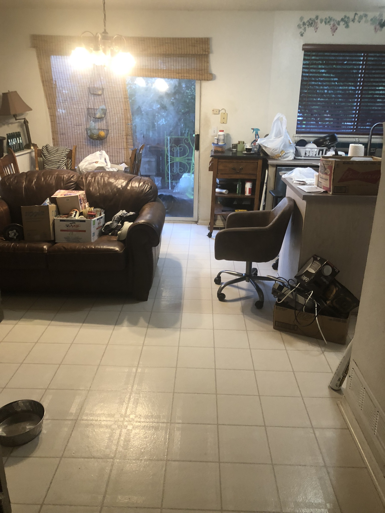
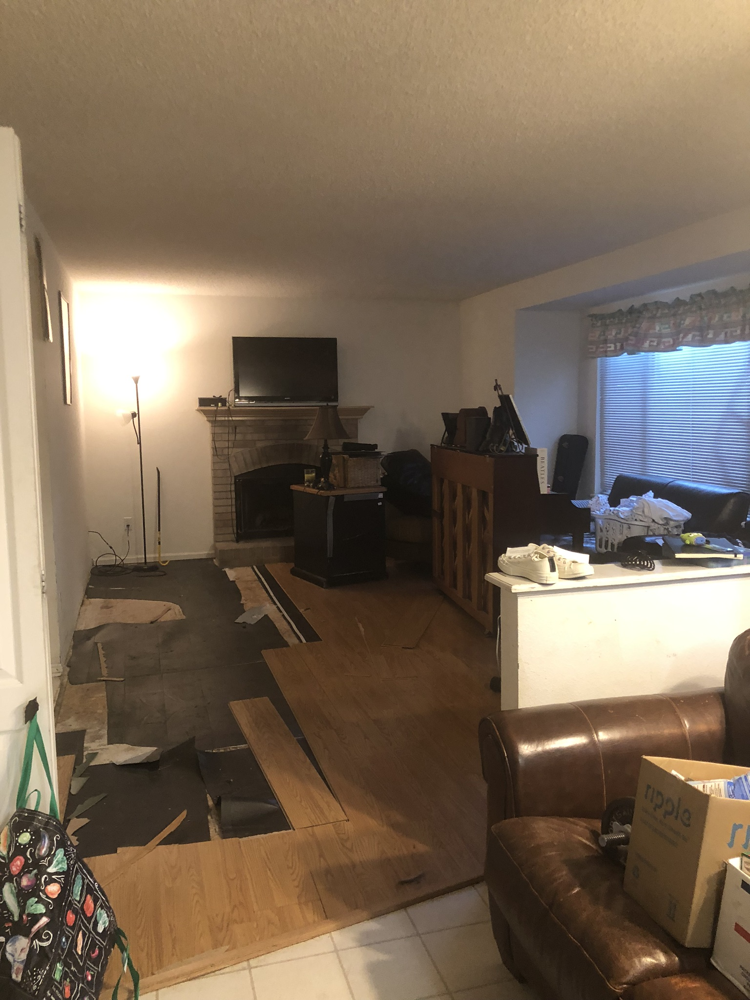
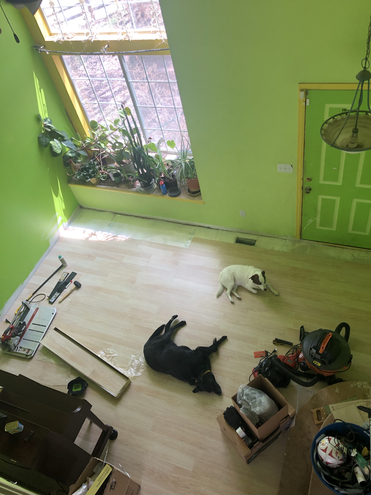
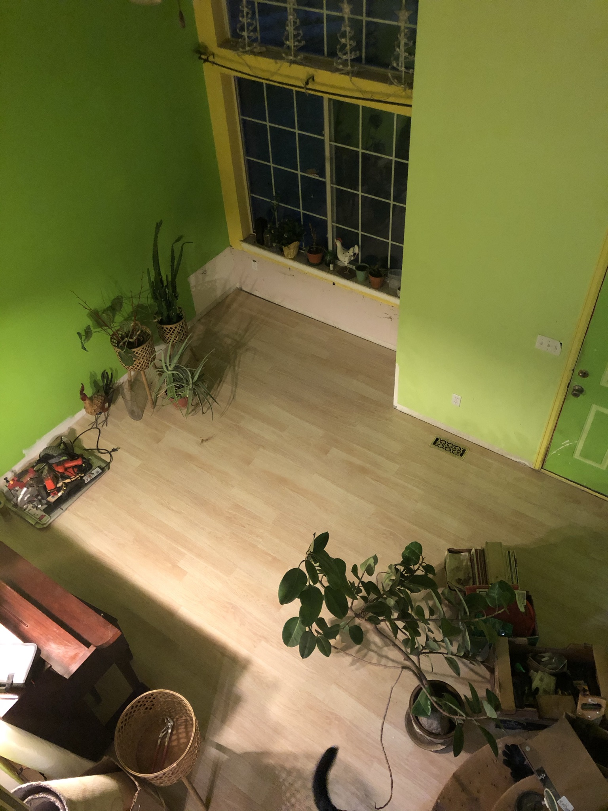
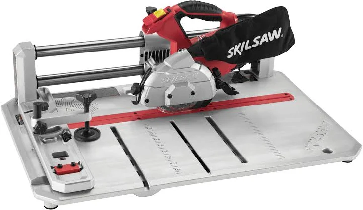

# 2019

- [2019](#2019)
- [1000 sqft Flooring](#1000-sqft-flooring)
    - [Built-In Bench Removal](#built-in-bench-removal)

# 1000 sqft Flooring

Before I started a new job, I went on a marathon ripping up the first floor of the home I grew up in. Unfortunately I don't have the greatest before/after pics from then. But all the flooring was replaced with the lighter oak color seen.

### Built-In Bench Removal

Took out the window bench thing that was unnecessary and took away from the beauty of the bay window. There was actually an outlet in there that no one knew about!

Shoutout to Skilsaw for helping install indoor flooring without needing to take trips back and forth to my miter saw in the garage. Can cut boards right in the room you're installing! In hindsight, ear protection would have been good. 
