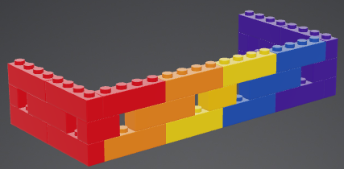
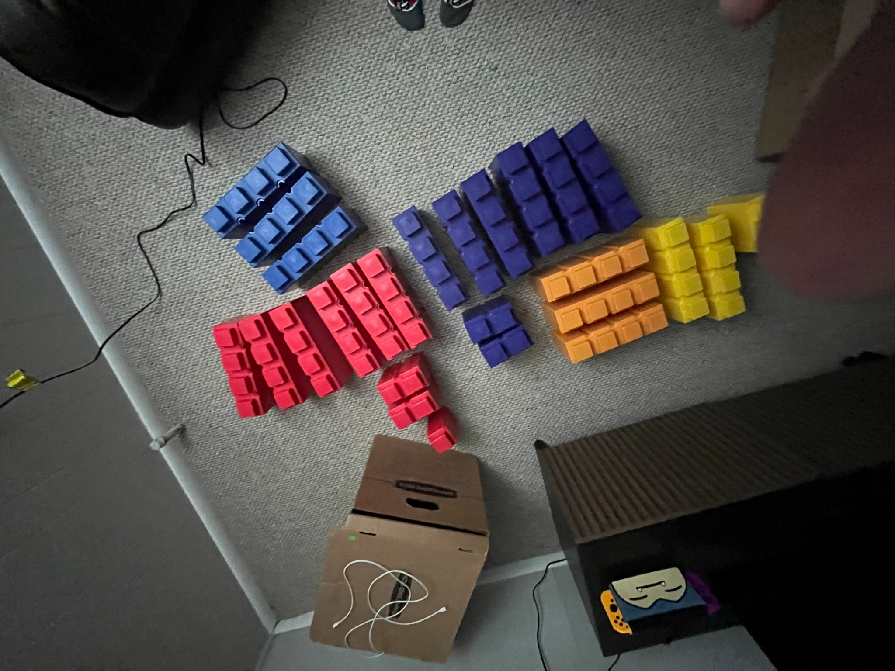

In 2022, my husband and I moved into our first home together. When furniture shopping, we decided we really wanted to get a recliner.

Unfortunately my dog Skipper loves to shadow me around and I can be forgetful. 

We didn't want him to get injured underneath the recliner leg area in a freak accident. 

So I decided we needed a barrier around the recliner! There didn't seem to be an existing solutions.

[Everblock](https://www.everblocksystems.com/our-products) sells lifesize legos.

I ended up using an  [online lego designer](https://mecabricks.com/en/models/mLvzWk3laAw) to make a model of what I would need, after measuring the chair and the Everblock sizes.

The gaps in the design were to save on costs since Everblocks are actually pretty pricey!

