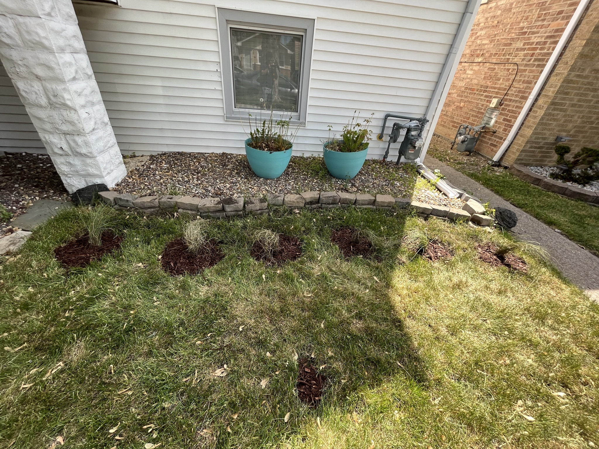

# 2023

- [2023](#2023)
  - [Front Yard](#front-yard)

## Front Yard

I hate grass and lawns. The history behind why we have them is uninspiring as well.

Also, I don't know how to use a lawn mower. 

At first I planted some [pink muhly grass from fastgrowingtrees.com](https://www.fast-growing-trees.com/products/pink-muhly-grass). **These were a ripoff and they all died.**

I decided to use the lasagna method to suffocate our grass and then mulch over it. I added edging on the sides, which had some unforeseen challenges; some of the areas for the edging stakes were blocked by concrete from the sidewalk pours. I ended up chiseling out chunks of concrete several inches underground.

I ended up planting coral bells, ornamental grasses, creeping phlox and a couple of dwarf Japanese maples. In the fall I planted some allium bulbs and asiatic lily bulbs. These came from reputable sellers: [Santa Rosa Gardens](https://santarosagardens.com/), [MrMaple](https://mrmaple.com/) and [Van Engelen](https://www.vanengelen.com/), all with nearly 100% survival rates despite being planted in July. All of the plants really started to shine in [2024](../README.md).

