# 2024

- [2024](#2024)
  - [Front Yard](#front-yard)
    - [April](#april)
    - [May](#may)
    - [October](#october)
  - [Basement](#basement)
    - [Before](#before)
    - [Damage](#damage)
    - [New Floor](#new-floor)
  - [Closet (unfinished)](#closet-unfinished)
    - [Before](#before-1)
    - [Deconstructed](#deconstructed)
    - [Hall Tree Temp Fix](#hall-tree-temp-fix)
  - [SFF PC Build](#sff-pc-build)

## Front Yard

### April

### May

### October

I ended up planting some dahlia tubers which produce some of the vibrant flowers. These are not perennial in my zone and need to be dug up in the fall in order to come back, but the long blooming time late in the season is worth it!

## Basement

### Before

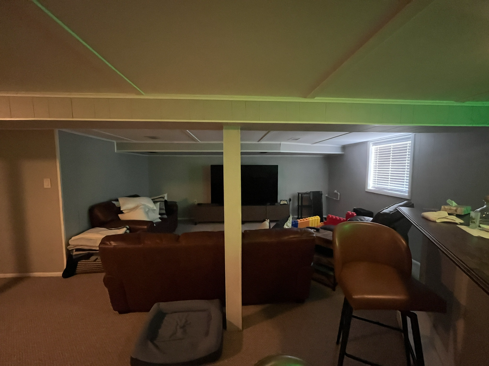
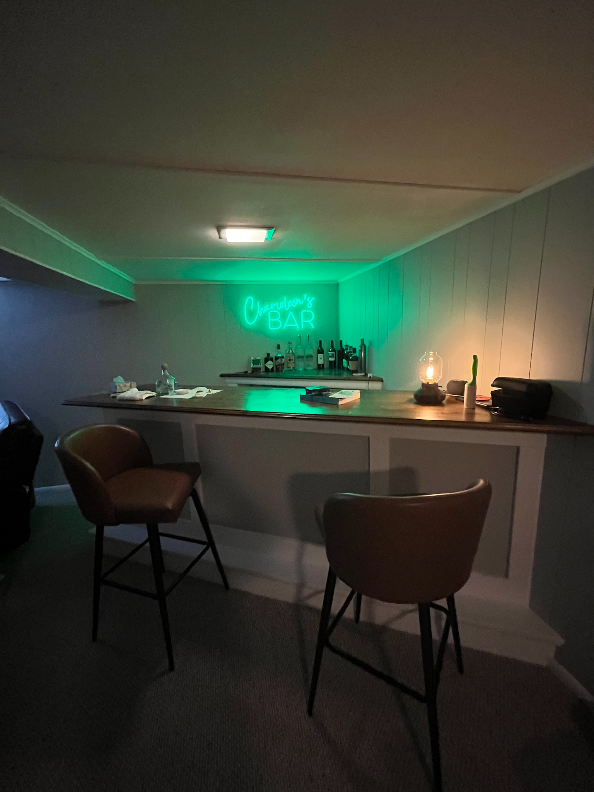

### Damage

Our basement got flooded with nasty-smelling sewage after a bad thunderestorm.

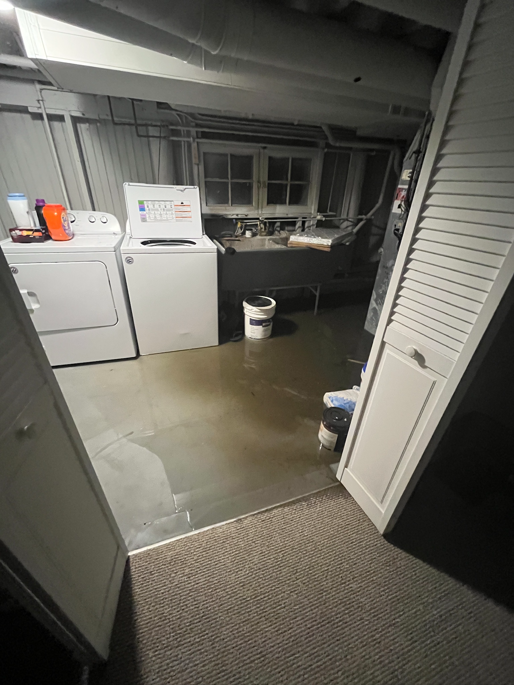

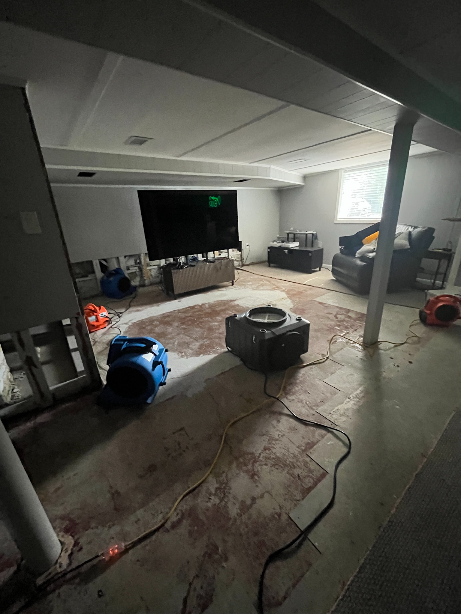

### New Floor

We ended up getting new flooring, drywall and paint. For the flooring we worked with our contractors to pay for an epoxy pour on the floor instead of carpeting. This would be a lot more moisture-proof going forward. The furniture no longer matches and I have a wishlist of white leather replacements to our brown stuff and other fun accent pieces to really make the space super fun. It's a work in progress.

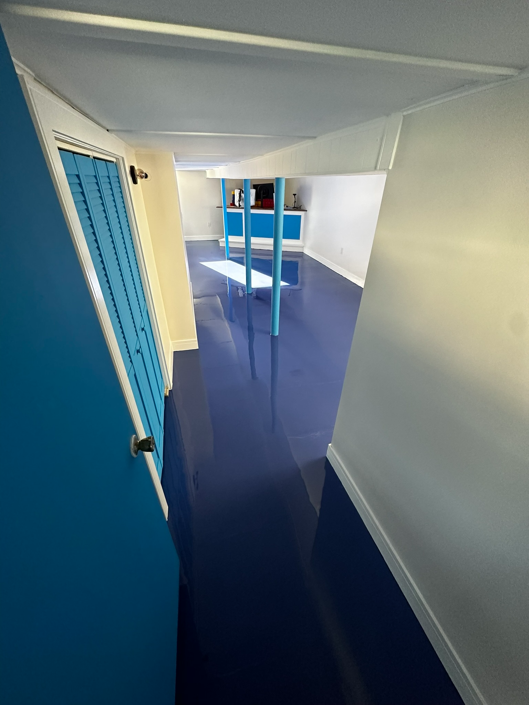
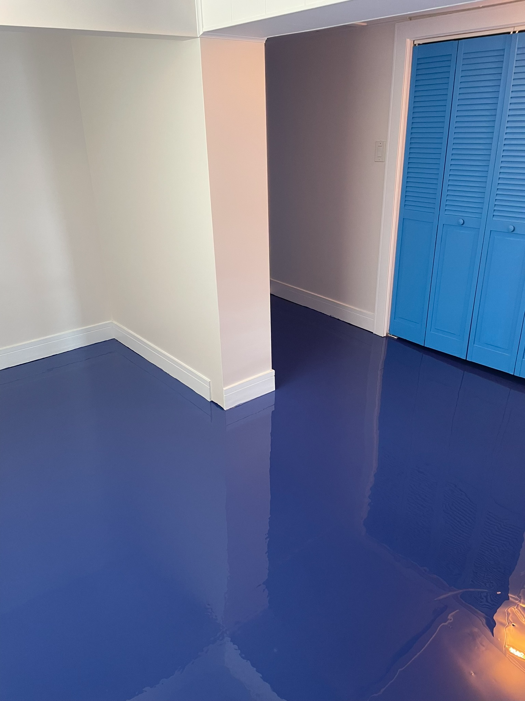
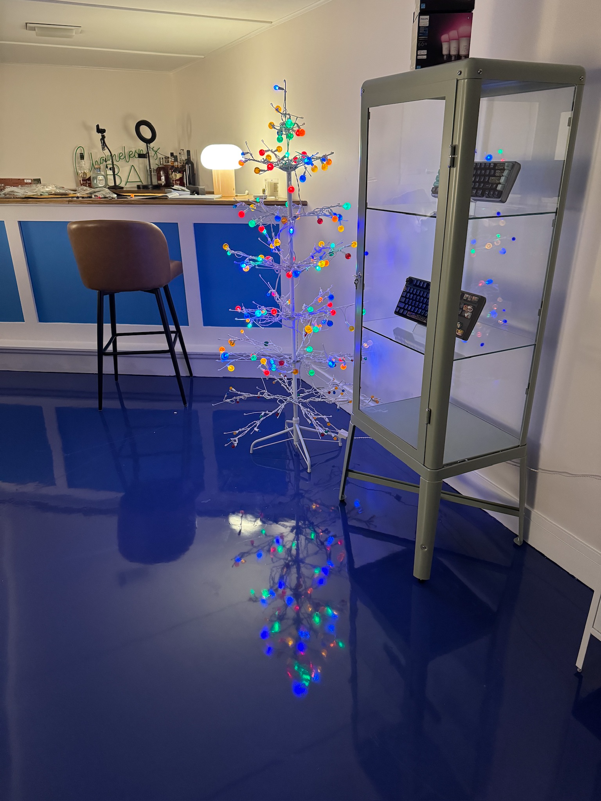

## Closet (unfinished)

Our entry closet was not very functional; the narrow space and old sliding doors made it really hard to get items in/out.

### Before

### Deconstructed

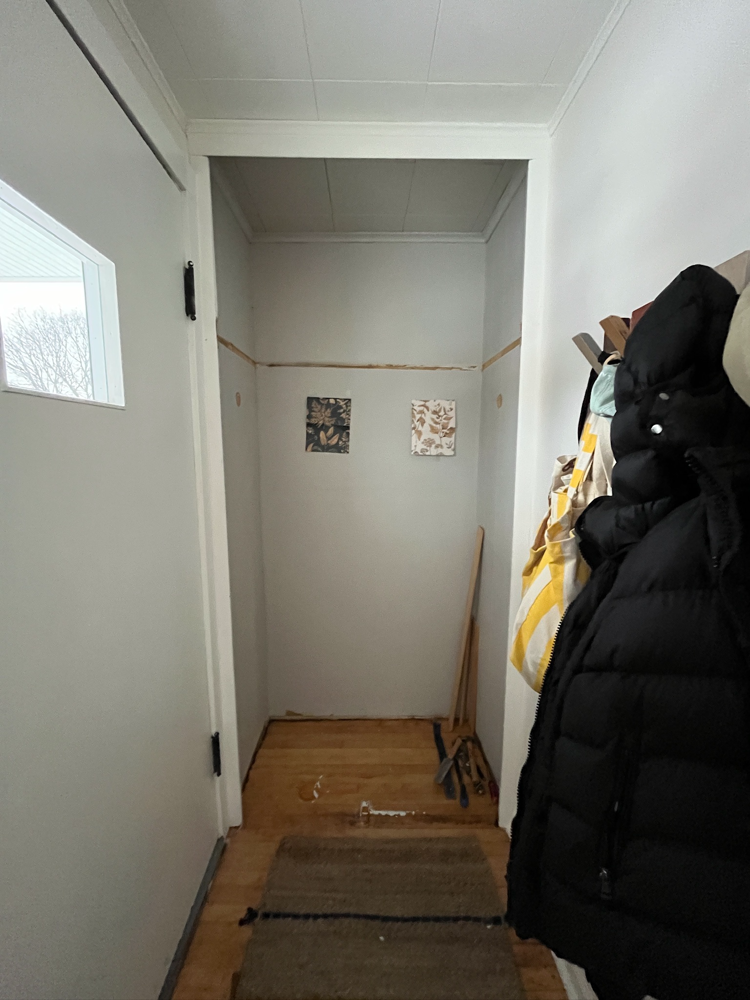

### Hall Tree Temp Fix

I ended up getting a god-awful-quality hall tree from Wayfair to shove in there. The end goal is to build a custom hall tree inside the area, possibly with some wallpaper behind it; after looking at dozens of samples, I didn't end up finding a wallpaper I liked and wasn't generic feeling! So maybe I'll just repaint the area instead.

TBC when I own saws and some tables to work on in my garage.

## SFF PC Build

My second SFF build ([first one in 2020](../2020/README.md#sff-pc-build)). Uses Fractal Design's [Terra case](https://www.fractal-design.com/products/cases/terra/) and RTX 4070 Ti.

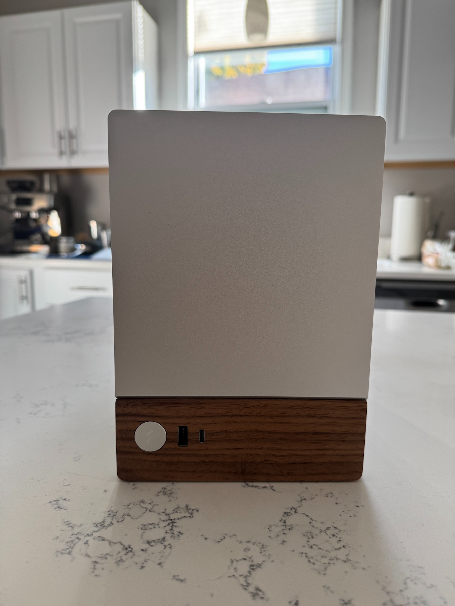
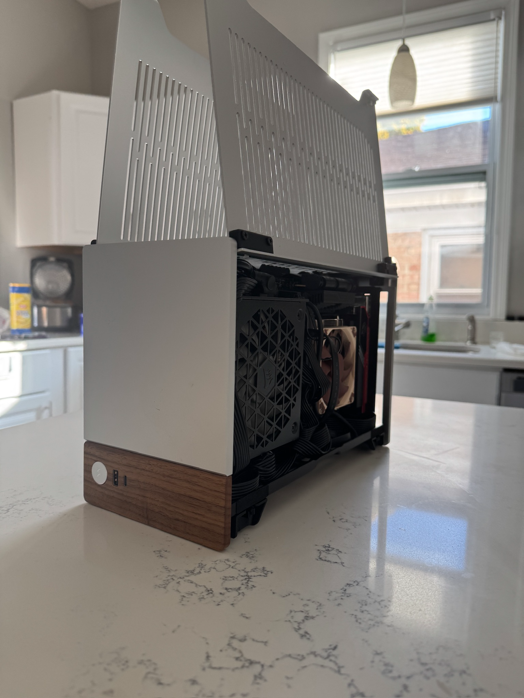
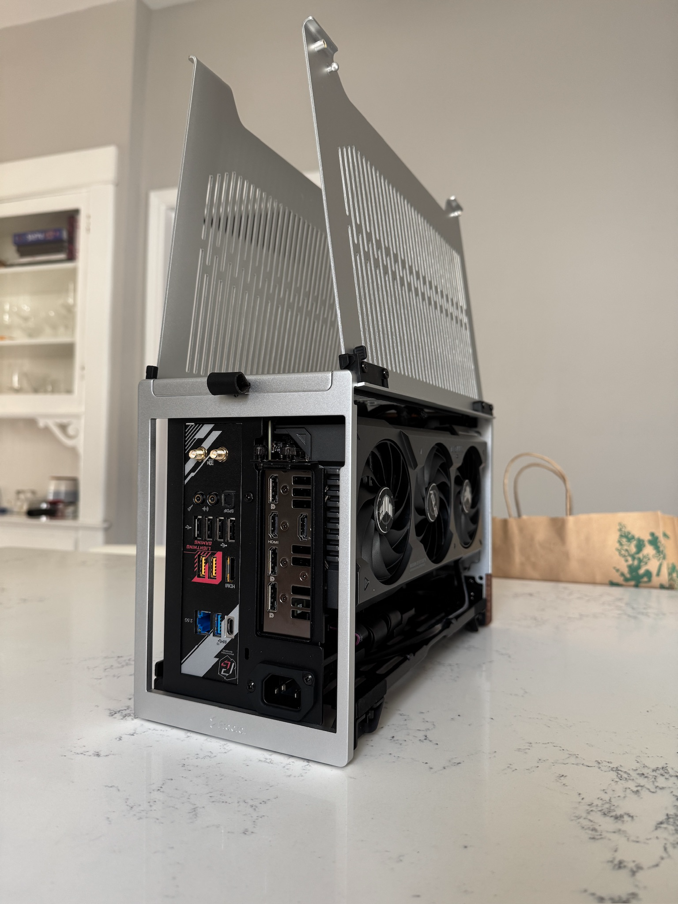
