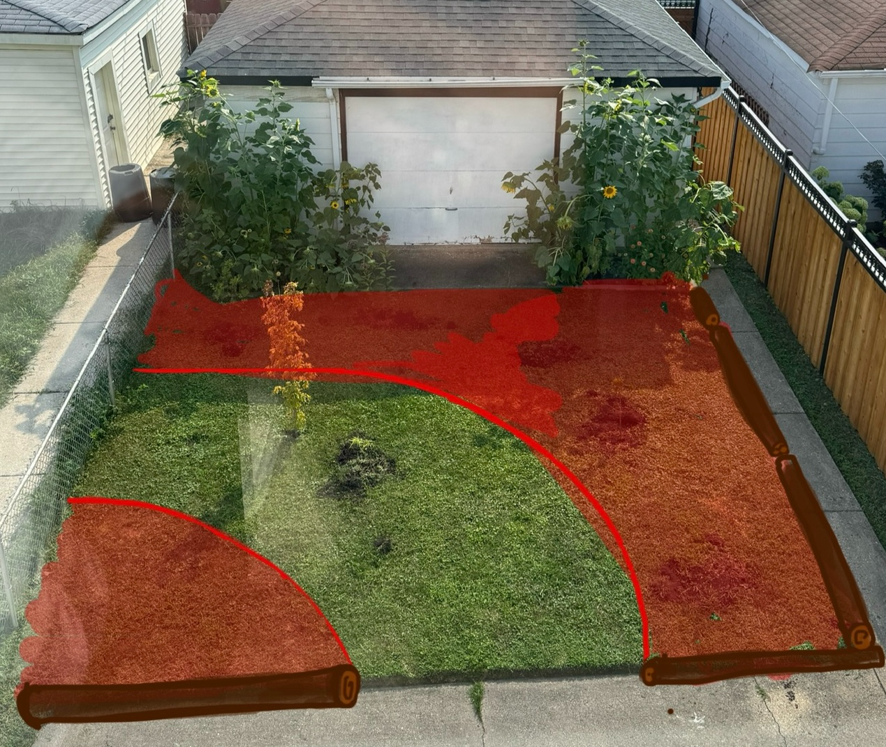
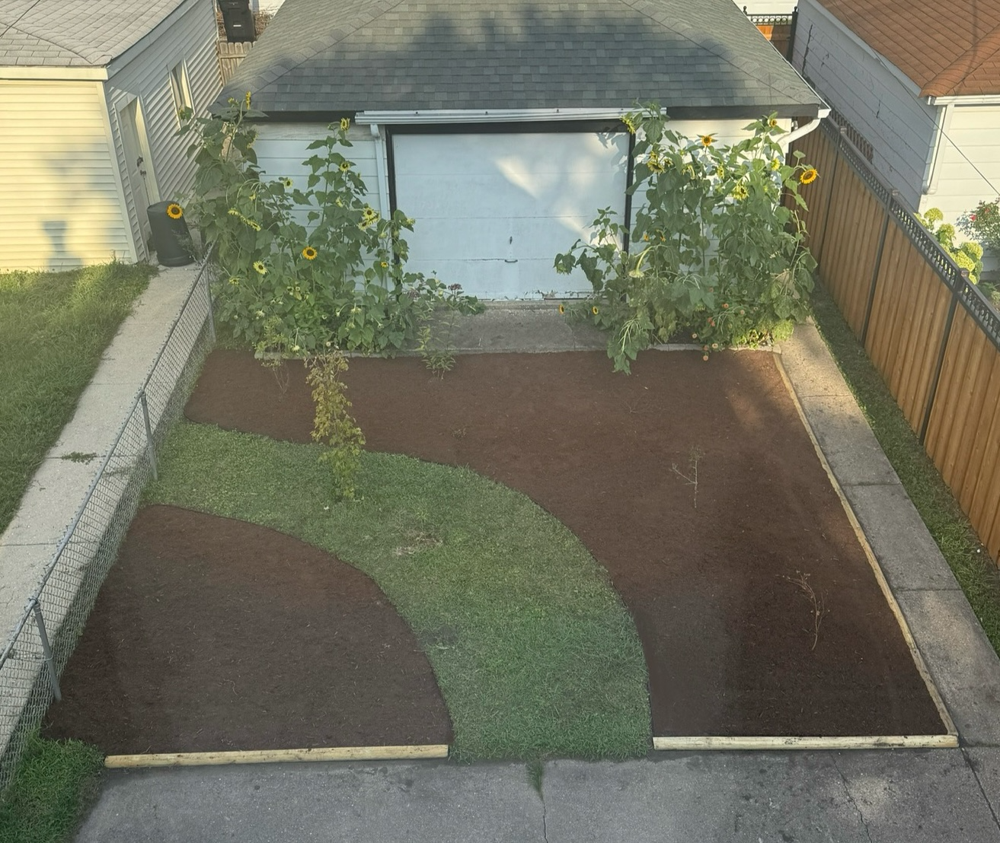

# 2025

- [2025 Projects](#2025-projects)
  - [Umbrella Tree](#umbrella-tree)
  - [Backyard](#backyard)
    - [Before](#before)
    - [Design](#design)
    - [Thumbtack Result](#thumbtack-result)
    - [Planting](#planting)

## Umbrella Tree

At a gardening shop, we found this weird large plant in a strange spot and it looked like it had been there a while. It was only $70 and they offered to deliver it to inside the house for free. 

So we adopted this umbrella tree plant.

I gave it a trim to try and fit it somewhere.

It grew a ton of foliage in the months following. Unfortunately, right now I'm learning how to kill off scale; at some point in late 2025 it got a bad infestation. It's a huge pain in the ass to fully exterminate them!

## Backyard

### Before

### Design

I designed an experimental idea to use in the backyard. 

### Thumbtack Result

I ended up hiring a contractor from Thumbtack to remove the sod and replace with grass. Unlike my front yard, I didn't want to mulch over the grass and add edging. They used my picture to help guide their work.

The work took their 3 person team a full 8 hour day to complete. They really worked hard! I'm glad I didn't try to tackle this project myself.

### Planting

In the fall, I planted a ton of plants, more dwarf Japanese maples and bulbs for the spring.

