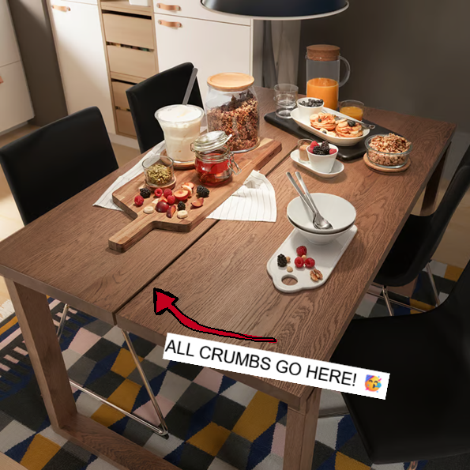
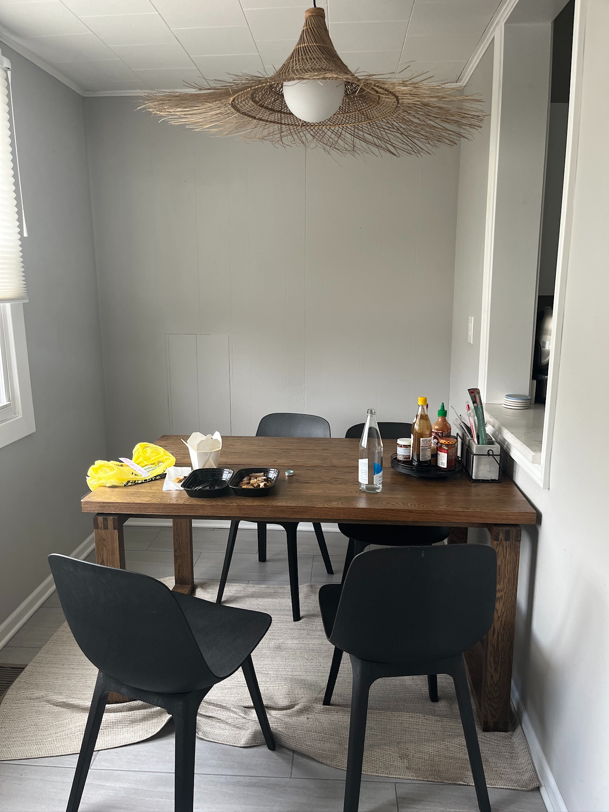
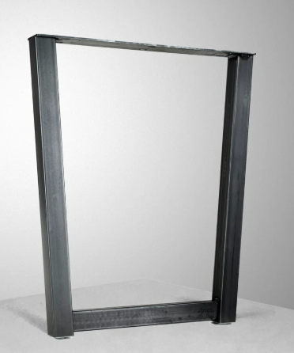

# 2026 Projects

## IKEA Table Split

When my husband and I were at IKEA, we got to the dining table section to pick something out. I had some ideas, but unfortunately my husband fell in love with [this]([moerbylanga](https://www.ikea.com/us/en/p/moerbylanga-table-oak-veneer-brown-stained-50386245/)) god-awful table that was more than what I was hoping to pay for:

I was hungry and tired from IKEA so after trying to change his mind, I ended up caving and agreeing to this table.

### Before

Sigh.

### Design

So once my husband finally agreed I was right about the table 3 years later, I came up with a design to reuse the parts to make into a table that fit into our space better.

### After

I ordered 3 custom height/width legs from [hairpinlegs](https://www.hairpinlegs.com/products/customizable-trapezoidal-narrow-tube-leg-raw-steel), but decided getting a 4th leg would be worth it. 2 tables would be more resuable, moveable and stable.

We are planning to resell the black chairs and buy some bar stools instead. This way, we can really enjoy the backyard garden as it matures and changes over the years.

Did I save money by doing this strange DIY hack? Absolutely not. But I didn't want to resell such a dumb design to someone else, and I was itching for a small project. 

Future plans for the dining nook include replacing the blinds, hanging plexiglass around the bird cage, brick veneer on the small wall and some fun paint. Going for an industrial vibe.